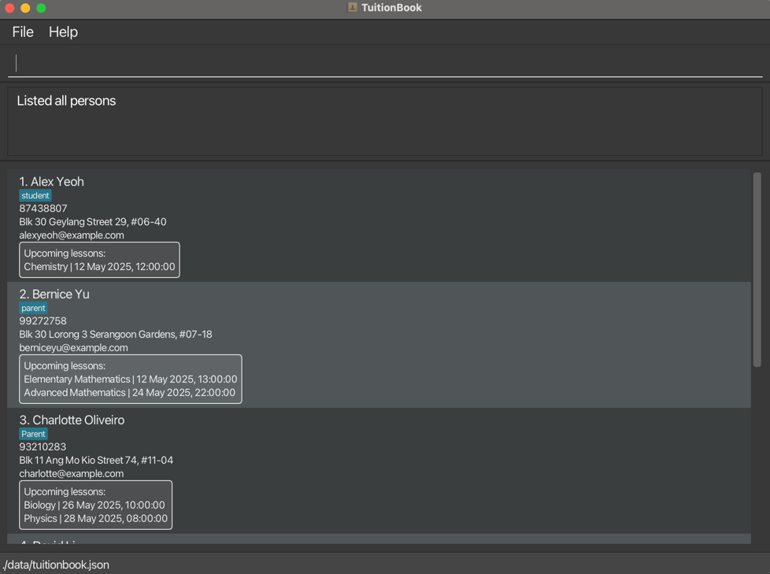

# TuitionBook

 

---

## Overview

TuitionBook is a streamlined, fast, and efficient way to access key student and parent information.
Designed with simplicity and speed in mind, this solution is perfect for private tuition teachers who prefer a
no-frills, text-based approach to managing student data.

### Target Users

TuitionBook was created to cater specifically for private tuition teachers

### Value Proposition

Provide fast access to student/parent contact details as well as their learning progress (Subjects or Modules taken,
Year of study and upcoming lesson timings), optimized for users who prefer a CLI.

### Features

- Add/Remove student contacts
- View student contacts
- and more!

---

### Acknowledgements

This project is based on the AddressBook-Level3 project created by the [SE-EDU initiative](https://se-education.org).