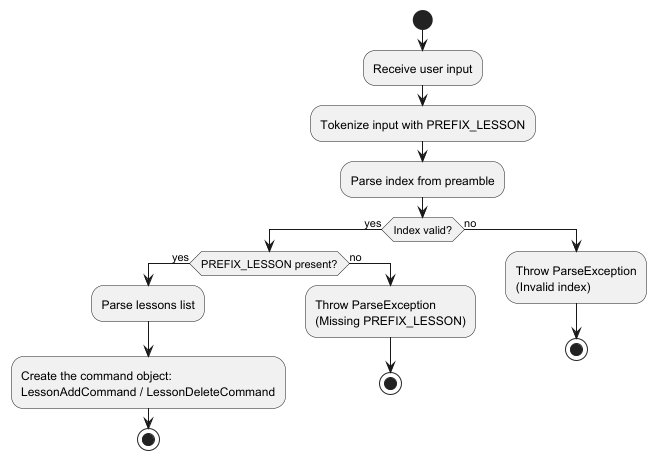

* Table of Contents
{:toc}

--------------------------------------------------------------------------------------------------------------------

## **Acknowledgements**

* AddressBook-Level3 (AB3) - [Website](https://se-education.org/addressbook-level3/)

--------------------------------------------------------------------------------------------------------------------

## **Setting up, getting started**

Refer to the guide [_Setting up and getting started_](SettingUp.md).

--------------------------------------------------------------------------------------------------------------------

## **Design**

:bulb: **Tip:** The `.puml` files used to create diagrams in this document `docs/diagrams` folder. Refer to the [_PlantUML Tutorial_ at se-edu/guides](https://se-education.org/guides/tutorials/plantUml.html) to learn how to create and edit diagrams.

### Architecture

The ***Architecture Diagram*** given above explains the high-level design of the App.

Given below is a quick overview of main components and how they interact with each other.

**Main components of the architecture**

**`Main`** (consisting of classes [`Main`](https://github.com/AY2425S2-CS2103-F10-3/tp/tree/master/src/main/java/seedu/tuitionbook/Main.java) and [`MainApp`](https://github.com/AY2425S2-CS2103-F10-3/tp/tree/master/src/main/java/seedu/tuitionbook/MainApp.java)) is in charge of the app launch and shut down.
* At app launch, it initializes the other components in the correct sequence, and connects them up with each other.
* At shut down, it shuts down the other components and invokes cleanup methods where necessary.

The bulk of the app's work is done by the following four components:

* [**`UI`**](#ui-component): The UI of the App.
* [**`Logic`**](#logic-component): The command executor.
* [**`Model`**](#model-component): Holds the data of the App in memory.
* [**`Storage`**](#storage-component): Reads data from, and writes data to, the hard disk.

[**`Commons`**](#common-classes) represents a collection of classes used by multiple other components.

**How the architecture components interact with each other**

The *Sequence Diagram* below shows how the components interact with each other for the scenario where the user issues the command `delete 1`.

Each of the four main components (also shown in the diagram above),

* defines its *API* in an `interface` with the same name as the Component.
* implements its functionality using a concrete `{Component Name}Manager` class (which follows the corresponding API `interface` mentioned in the previous point.

For example, the `Logic` component defines its API in the `Logic.java` interface and implements its functionality using the `LogicManager.java` class which follows the `Logic` interface. Other components interact with a given component through its interface rather than the concrete class (reason: to prevent outside component's being coupled to the implementation of a component), as illustrated in the (partial) class diagram below.

The sections below give more details of each component.

### UI component

The **API** of this component is specified in [`Ui.java`](https://github.com/AY2425S2-CS2103-F10-3/tp/tree/master/src/main/java/seedu/tuitionbook/ui/Ui.java)

The UI consists of a `MainWindow` that is made up of parts e.g.`CommandBox`, `ResultDisplay`, `PersonListPanel`, `StatusBarFooter` etc. All these, including the `MainWindow`, inherit from the abstract `UiPart` class which captures the commonalities between classes that represent parts of the visible GUI.

The `UI` component uses the JavaFx UI framework. The layout of these UI parts are defined in matching `.fxml` files that are in the `src/main/resources/view` folder. For example, the layout of the [`MainWindow`](https://github.com/AY2425S2-CS2103-F10-3/tp/tree/master/src/main/java/seedu/tuitionbook/ui/MainWindow.java) is specified in [`MainWindow.fxml`](https://github.com/AY2425S2-CS2103-F10-3/tp/tree/master/src/main/resources/view/MainWindow.fxml)

The `UI` component,

* executes user commands using the `Logic` component.
* listens for changes to `Model` data so that the UI can be updated with the modified data.
* keeps a reference to the `Logic` component, because the `UI` relies on the `Logic` to execute commands.
* depends on some classes in the `Model` component, as it displays `Person` object residing in the `Model`.

### Logic component

**API** : [`Logic.java`](https://github.com/AY2425S2-CS2103-F10-3/tp/tree/master/src/main/java/seedu/tuitionbook/logic/Logic.java)

Here's a (partial) class diagram of the `Logic` component:

The sequence diagram below illustrates the interactions within the `Logic` component, taking `execute("delete 1")` API call as an example.

:information_source: **Note:** The lifeline for `DeleteCommandParser` should end at the destroy marker (X) but due to a limitation of PlantUML, the lifeline continues till the end of diagram.

How the `Logic` component works:

1. When `Logic` is called upon to execute a command, it is passed to an `AddressBookParser` object which in turn creates a parser that matches the command (e.g., `DeleteCommandParser`) and uses it to parse the command.
1. This results in a `Command` object (more precisely, an object of one of its subclasses e.g., `DeleteCommand`) which is executed by the `LogicManager`.
1. The command can communicate with the `Model` when it is executed (e.g. to delete a person). 
   Note that although this is shown as a single step in the diagram above (for simplicity), in the code it can take several interactions (between the command object and the `Model`) to achieve.
1. The result of the command execution is encapsulated as a `CommandResult` object which is returned back from `Logic`.

Here are the other classes in `Logic` (omitted from the class diagram above) that are used for parsing a user command:

How the parsing works:
* When called upon to parse a user command, the `AddressBookParser` class creates an `XYZCommandParser` (`XYZ` is a placeholder for the specific command name e.g., `AddCommandParser`) which uses the other classes shown above to parse the user command and create a `XYZCommand` object (e.g., `AddCommand`) which the `AddressBookParser` returns back as a `Command` object.
* All `XYZCommandParser` classes (e.g., `AddCommandParser`, `DeleteCommandParser`, ...) inherit from the `Parser` interface so that they can be treated similarly where possible e.g, during testing.

### Model component
**API** : [`Model.java`](https://github.com/AY2425S2-CS2103-F10-3/tp/tree/master/src/main/java/seedu/tuitionbook/model/Model.java)

The `Model` component,

* stores the address book data i.e., all `Person` objects (which are contained in a `UniquePersonList` object).
* stores the currently 'selected' `Person` objects (e.g., results of a search query) as a separate _filtered_ list which is exposed to outsiders as an unmodifiable `ObservableList<Person>` that can be 'observed' e.g. the UI can be bound to this list so that the UI automatically updates when the data in the list change.
* stores a `UserPref` object that represents the user’s preferences. This is exposed to the outside as a `ReadOnlyUserPref` objects.
* does not depend on any of the other three components (as the `Model` represents data entities of the domain, they should make sense on their own without depending on other components)

:information_source: **Note:** An alternative (arguably, a more OOP) model is given below. It has a `Tag` list in the `AddressBook`, which `Person` references. This allows `AddressBook` to only require one `Tag` object per unique tag, instead of each `Person` needing their own `Tag` objects. 

### Storage component

**API** : [`Storage.java`](https://github.com/AY2425S2-CS2103-F10-3/tp/tree/master/src/main/java/seedu/tuitionbook/storage/Storage.java)

The `Storage` component,
* can save both address book data and user preference data in JSON format, and read them back into corresponding objects.
* inherits from both `AddressBookStorage` and `UserPrefStorage`, which means it can be treated as either one (if only the functionality of only one is needed).
* depends on some classes in the `Model` component (because the `Storage` component's job is to save/retrieve objects that belong to the `Model`)

### Common classes

Classes used by multiple components are in the `seedu.tuitionbook.commons` package.

--------------------------------------------------------------------------------------------------------------------

## **Implementation**

This section describes some noteworthy details on how certain features are implemented.

###  Adding/Removing lessons feature

#### Implementation - Parsers

As for parsing the commands entered by the user, there is the `LessonAddCommandParser` and `LessonDeleteCommandParser`.
They are used to extract the lesson information provided, along with the index of the contact to operate on.

Both Parser Commands perform the key steps during execution:

- Tokenise the user's input suing `ArgumentTokenizer`, which splits the index and arguments by `PREFIX_LESSON`
- Index of person to operate on is determined with `ParserUtil#parseIndex`, and throws a `ParseException` if the index is invalid.
- Checks that `PREFIX_LESSON` exists using `arePrefixesPresent` implemented by the parsers.
- Parses the lessons into `Lesson` objects using `ParserUtil#parseLessons`, and throws a `ParseException` if the lesson details provided are incorrect.
- Returns a constructed `LessonAddCommand` or `LessonDeleteCommand` with the parsed index and lessons list.

The following activity diagram summarizes what happens when the parsers (`LessonAddCommandParser` and `LessonDeleteCommandParser`) attempts to parse the user's input:

#### Implementation - Commands

The lesson adding and removing feature is implemented by the `LessonAddCommand` and `LessonDeleteCommand` classes.
They are used to add or remove lessons of a contact in TuitionBook, based on the index specified by the user.

Both commands perform the following key steps during execution:

- Validate that INDEX is within the bounds of the filtered persons list `model#getFilteredPersonList()`.
- Check for duplicate lessons provided by the user after parsing
  - Duplicates existing within 2 different users is detected using `Model#hasLesson(List<Lesson>)`
  - Duplicates existing within the command is detected with a hashmap of lesson timings
- Perform the action on the person
  - In `LessonAddCommand`, the existing and new lessons are combined using `Stream.concat`
  - In `LessonDeleteCommand`, the lessons to delete are removed from the existing lessons using Streams filter.
- Updating the person using `createEditedPerson` method implemented by both commands, which creates a new Person with updated lessons.
- TuitionBook is then updated using `Model#setPerson` to update the model with the new person, and the UI is refreshed using `Model#updateFilteredPersonList`.
- Returns a constructed `CommandResult` with success messages and details of lessons added/removed.

The following diagram summarises what happens when a user executes the `LessonAddCommand`:

The following diagram summarises what happens when a user executes the `LessonDeleteCommand`:

The following sequence diagram shows how a lesson-add operation goes through the `Logic` component:

The following sequence diagram shows how a lesson-delete operation goes through the `Logic` component:

--------------------------------------------------------------------------------------------------------------------

## **Documentation, logging, testing, configuration, dev-ops**

* [Documentation guide](Documentation.md)
* [Testing guide](Testing.md)
* [Logging guide](Logging.md)
* [Configuration guide](Configuration.md)
* [DevOps guide](DevOps.md)

--------------------------------------------------------------------------------------------------------------------

## **Appendix: Requirements**

### Product scope

**Target user profile**:

* is a private tuition teacher
* has a need to manage a significant number of student/parent contacts
* prefer desktop apps over other types
* can type fast
* prefers typing to mouse interactions
* is reasonably comfortable using CLI apps

**Value proposition**: Provide fast access to student/parent contact details as well as their learning progress (Subjects or Modules taken, Year of study and upcoming lesson timings), optimized for users who prefer a CLI.

### User stories

Priorities: High (must have) - `* * *`, Medium (nice to have) - `* *`, Low (unlikely to have) - `*`

| Priority | As a …​           | I want to …​                                                                                                        | So that I can…​                                                              |
|----------|-------------------|---------------------------------------------------------------------------------------------------------------------|------------------------------------------------------------------------------|
| `***`    | First time user   | Add new student profiles with their basic details such as contact number and address                                | I can store the information in one place and find them when I need to        |
| `***`    | First time user   | Add new student profiles with their advanced details such as student's subjects and lesson timings                  | I can store the information in one place and find them when I need to        |
| `***`    | First time user   | Delete student profiles for graduating students                                                                     | I don't waste time looking at old data.                                      |
| `***`    | Beginner user     | View a student's complete profile (name, contact details, address) in one screen                                    | I have all the necessary information when needed                             |
| `**`     | Potential user    | View the sample data                                                                                                | I can visualise how the app will look when it is populated with data.        |
| `**`     | New user          | Have a quick tutorial of the main features                                                                          | I can understand how to use the app effectively.                             |
| `**`     | First time user   | Clear all sample data                                                                                               | I can begin populating the app with new data.                                |
| `**`     | Beginner user     | Search for a student's details                                                                                      | I don't waste time looking through all the users.                            |
| `**`     | Beginner user     | View all lessons schedules for a specific day                                                                       | I can view the lessons for the day.                                          |
| `**`     | Familiar user     | Add modules to a student                                                                                            | I can track the new modules a student is taking.                             |
| `**`     | Familiar user     | Delete modules from a student                                                                                       | I can track the modules a student is dropping.                               |
| `**`     | Familiar user     | Sort lessons by upcoming date                                                                                       | I can see what lessons are coming up.                                        |
| `*`      | Familiar user     | Add user profile pictures                                                                                           | I can recognise the student when I see them                                  |
| `**`     | Familiar user     | Filter by day of the week                                                                                           | I can plan my weekly schedule effectively                                    |
| `**`     | Familiar user     | indicate the relationship of a parent to a student (e.g. "Mother", "Brother", "Guardian")                           | I can know what is the connection between the parent and student             |
| `**`     | Familiar user     | Filter by module                                                                                                    | I can plan lesson plans efficiently                                          |
| `*`      | Familiar user     | track student module progress                                                                                       | I can plan my next lesson better                                             |
| `**`     | Familiar user     | archive student details                                                                                             | I can track students taking leave of absence and coming back at a later time |
| `**`     | Familiar user     | edit command shortcuts                                                                                              | I can type commands in a way I prefer so it will be faster                   |
| `**`     | Familiar user     | autofill address suggestions when students live at the same location (e.g. same HDB block, different unit number)   | I can add student addresses easier                                           |
| `**`     | Familiar user     | see public holidays marked in the calendar                                                                          | I do not schedule lessons during holidays                                    |
| `**`     | Familiar user     | autofill module details                                                                                             | I can efficiently add modules to multiple students                           |
| `**`     | Tutor             | search for students based on postal code                                                                            | I can better plan my travel route                                            |
| `**`     | Tutor             | identify conflicting schedules                                                                                      | I can avoid overlapping lessons                                              |
| `**`     | Tutor             | edit multiple scheduled lessons at once                                                                             | I can manage bulk schedule changes more efficiently                          |
| `**`     | Tutor             | look at my teaching schedules in different views (daily, weekly, monthly)                                           | I can plan ahead effectively                                                 |
| `**`     | Tutor             | indicate time slots as "travelling time" or "lunch time"                                                            | I can avoid overlapping scheduling lessons during other misc timings         |
| `**`     | Tutor             | tag students with labels ("P1", "Sec3", etc)                                                                        | I can better plan my teaching content                                        |
| `**`     | Tutor             | tag students with location labels ("Clementi Area", "Bishan Area", etc.)                                            | I can better organise my teaching route                                      |
| `*`      | Tutor             | export student's contact details to my phone's contact list                                                         | I can contact them without using TuitionBook                                 |
|----------|-------------------| ------------------------------------------------------------------------------------------------------------------- |------------------------------------------------------------------------------|

*{More to be added}*

### Use cases

**Use case: UC01 - View all contacts**

**MSS**

1. User requests to list contacts.
2. TuitionBook shows a list of contacts.

   Use case ends.

**Extensions**

* 2a. The list is empty.
  * 2a1. TuitionBook shows an error message.

    Use case ends.

**Use case: UC02 - Add a contact**

**MSS**

1. User requests to add a contact, providing the details
2. TuitionBook checks the input data
3. TuitionBook adds the contact

   Use case ends.

**Extensions**

* 2a. Input field(s) are incorrect
  * 2a1. TuitionBook shows an error message

    Use case ends

* 2b. Contact name already exists.
  * 2b1. TuitionBook prints the error message for duplicate user.

    Use case ends.

* 2c. Lesson already exists.
  * 2c1. TuitionBook prints the error message for same lesson timeslot.

    Use case ends.

* 2d. Lessons with the same timeslot found in input details given.
    * 2d1. TuitionBook prints the error message for same lesson timeslot.

    Use case ends.

* 3a. Error occurs when saving to file.
  * 3a1. TuitionBook shows an error message.

    Use case ends.

**Use case: UC03 - Delete a contact**

**MSS**

1. User requests to delete a contact, providing the contact index
2. TuitionBook checks the contact index.
3. TuitionBook deletes the contact.

   Use case ends.

**Extensions**

* 2a. Contact index is invalid.
    * 2a1. TuitionBook shows an error message

      Use case ends.

* 3a. Error occurs when saving to file.
    * 3a1. TuitionBook shows an error message.

      Use case ends.

**Use case: UC04 - Edit a contact**

**MSS**

1. User requests to edit a contact, providing the details.
2. TuitionBook checks the input data
3. TuitionBook edits the contact

    Use case ends.

**Extensions**

* 2a. Input field(s) are incorrect
  * 2a1. TuitionBook shows an error message

    Use case ends.

* 2b. Contact name already exists.
    * 2b1. TuitionBook prints the error message for duplicate user.

      Use case ends.

* 3a. Error occurs when saving to file.
    * 3a1. TuitionBook shows an error message.

      Use case ends.

**Use case: UC05 - Find contact**

**MSS**

1. User types in the full name of the contact(s) to find.
2. TuitionBook searches for contacts with the exact name specified.
3. TuitionBook returns a list of contacts with matching names.

    Use Case ends.

**Extensions**

* 1a. User enters an invalid command
    * 1a1. TuitionBook shows an error message.

        Use Case ends
* 3a. No contacts found matching the name specified.
  * 3a1. TuitionBook shows a 0 persons found message along with no contacts shown.

    Use Case ends.

**Use case: UC06 - Add lessons to a contact**

**MSS**

1. User types in contact index to add lessons to, with lessons to add.
2. TuitionBook checks the contact index, and lessons validity.
3. TuitionBook adds the lessons to the contact.

   Use case ends.

**Extensions**

* 2a. Contact index is invalid.
    * 2a1. TuitionBook shows an error message.

        Use case ends

* 2b. Lessons provided has the same date and time slot as an existing lesson in TuitionBook.
    * 2b1. TuitionBook shows an error message.

        Use case ends

* 2c. Lessons with the same timeslot found in input details given.
    * 2c1. TuitionBook prints the error message for same lesson timeslot.

      Use case ends

**Use case: UC07 - Delete a contact's lesson**

**MSS**

1. User requests to delete a contact's lesson, providing the contact index and lessons to delete
2. TuitionBook checks the contact index, and lessons validity.
3. TuitionBook deletes the contact's lessons.

   Use case ends.

**Extensions**

* 2a. Contact index is invalid.
    * 2a1. TuitionBook shows an error message

      Use case ends

* 2b. Lessons provided does not exist in contact selected.
    * 3a1. TuitionBook shows an error message.

      Use case ends.

**Use case: UC08 - View a contact's lessons**

**MSS**

1. User requests to list a specified contact's lessons.
2. TuitionBook checks the contact index and contact lessons.
3. TuitionBook shows a list of lessons for the contact.

   Use case ends.

**Extensions**

* 2a. Contact index is invalid.
    * 2a1. TuitionBook shows an error message

      Use case ends

### Non-Functional Requirements

1.  Should work on any _mainstream OS_ as long as it has Java `17` or above installed.
2.  Should be able to hold up to 1000 persons without a noticeable sluggishness in performance for typical usage.
3.  A user with above average typing speed - around 40-60 WPM based on Singapore's average typing speed, for regular English text (i.e. not code, not system admin commands) should be able to accomplish most of the tasks faster using commands than using the mouse.

### Glossary

* **Mainstream OS**: Windows, Linux, Unix, MacOS
* **Private contact detail**: A contact detail that is not meant to be shared with others
* **Module**: A subject or topic that will be being taught.
* **Non-Functional Requirements**: Constraints that should be followed with regards to the system's development and operation.
* **Alphanumeric**: A character that is either a letter in the english alphabet or a number. Specifically from a-z, A-Z, 0-9.
* **Lesson**: The scheduled date and time that the tutor will teach his students a module.
* **JSON (JavaScript Object Notation)** : The file format the system uses to store contact details.

--------------------------------------------------------------------------------------------------------------------

## **Appendix: Instructions for manual testing**

Given below are instructions to test the app manually.

:information_source: **Note:** These instructions only provide a starting point for testers to work on;
testers are expected to do more *exploratory* testing.

### Launch and shutdown

1. Initial launch

   1. Ensure you have Java `17` or above installed in your Computer. 
         **Mac users:** Ensure you have the precise JDK version prescribed [here](https://se-education.org/guides/tutorials/javaInstallationMac.html).

   1. Download the latest `.jar` file from [here](https://github.com/AY2425S2-CS2103-F10-3/tp/releases).

   1. Copy the file to the folder you want to use as the _home folder_ for your TuitionBook.

   1. Open a command terminal, `cd` into the folder you put the jar file in, and use the `java -jar tuitionbook.jar` command to run the application. 
      A GUI similar to the below should appear in a few seconds. Note how the app contains some sample data and the window size may not be optimum. 
      

1. Saving window preferences

   1. Resize the window to an optimum size. Move the window to a different location. Close the window.

   1. Re-launch the app by running the `java -jar tuitionbook.jar` command again. 
       Expected: The most recent window size and location is retained.

3. Shutdown

    1. Enter the `exit` command to close the application.

### Deleting a person

1. Deleting a person while all persons are being shown

   1. Prerequisites: List all persons using the `list` command. Multiple persons in the list.

   1. Test case: `delete 1` 
      Expected: First contact is deleted from the list. Details of the deleted contact shown in the status message. Timestamp in the status bar is updated.

   1. Test case: `delete 0` 
      Expected: No person is deleted. Error details shown in the status message. Status bar remains the same.

   1. Other incorrect delete commands to try: `delete`, `delete x`, `...` (where x is larger than the list size) 
      Expected: Similar to previous.

### Saving data

1. Dealing with missing data files

   1. From the initial sample data, run a command to initiate a save to the data file and close the application.

   1. Delete the data file and re-launch the application. 
      Expected: TuitionBook will restart with the sample data.

1. Dealing with corrupted data files

   1. From the initial sample data, run a command to initiate a save to the data file and close the application.

   1. Modify any contact to have the same name and/or lesson with another contact in the data file and re-launch the application. 
      Expected: TuitionBook will start with empty data. The data file will only update after a save has been initiated.
